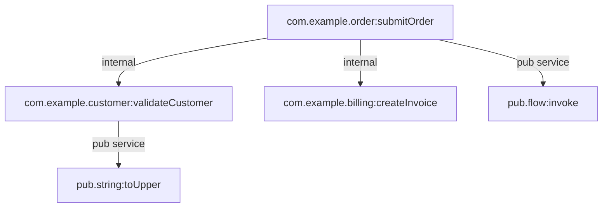

# Order Submission

Receives an order request, validates customer data, creates an invoice, and records that an audit/event publication step is dynamically invoked.

## Entrypoints

- `com.example.order:submitOrder`

## Business Flow

### 1. Receive request

Accept the order submission request and orchestrate downstream work.

- `com.example.order:submitOrder`

### 2. Validate customer

Confirm that customer data is usable before billing.

- `com.example.customer:validateCustomer`

### 3. Create invoice

Create an invoice using a Java service whose implementation source is unresolved in this sample.

- `com.example.billing:createInvoice`

## Services

- `com.example.order:submitOrder`
- `com.example.customer:validateCustomer`
- `com.example.billing:createInvoice`

## Supporting Technical Services

_No supporting technical services outside configured business steps._

## External Dependencies

- `pub.flow:invoke`
- `pub.string:toUpper`

## Dynamic Invocation Risks

- `com.example.order:submitOrder` uses `pub.flow:invoke` at step `0.0.2`

## Diagram

## Risks And Unknowns

- `DYNAMIC_INVOKE_TARGET_UNKNOWN`: Dynamic invocation via 'pub.flow:invoke' at step 0.0.2; target cannot be resolved statically.
- `JAVA_SOURCE_NOT_FOUND`: Java service implementation source could not be found by service name.
