# Synthetic Geographic Address Validation

Example process for the root-level sample artifacts. The service identity is inferred because the sample files are not inside a full webMethods package tree.

## Entrypoints

- `synthetic.current:flow_1`

## Services

- `synthetic.current:flow_1`

## Dependencies

- `di.utils.bool:strBoolToNumber`
- `di.utils:generateTransactionName`
- `di.utils:nullToUnspecified`
- `inea.utils:stringToDate`
- `oa.adapter.db_flow._create:createGAVFailReason`
- `oa.adapter.db_flow._create:createGeographicAddresssValidation`
- `oa.adapter.db_flow._get:getNewEventId`
- `oa.adapter.services.common:checkErrorResult`
- `oa.adapter.services.common:getProviderConnection`
- `oa.adapter.services.common:isPatchAllowed`
- `oa.adapter.services.common:saveEvent`
- `oa.adapter.services.geographicAddressManagement.geographicAddress:createGeographicAddress`
- `oa.adapter.services.geographicAddressManagement.geographicAddress:findGeographicAddressesForValidations`
- `oa.adapter.services.geographicAddressManagement.geographicAddress:getGeographicAddress`
- `oa.adapter.services.geographicAddressManagement.geographicAddressValidation:getGeographicAddressValidation`
- `pub.art.transaction:commitTransaction`
- `pub.art.transaction:rollbackTransaction`
- `pub.art.transaction:startTransaction`
- `pub.date:formatDate`
- `pub.date:getCurrentDateString`
- `pub.flow:clearPipeline`
- `pub.flow:getLastError`
- `pub.list:sizeOfList`
- `pub.publish:publish`
- `pub.string:toUpper`

## Diagram

```mermaid
graph TD
  n_synthetic_current_flow_1["synthetic.current:flow_1"]
  n_synthetic_current_flow_1 -->|pub service| n_pub_list_sizeOfList["pub.list:sizeOfList"]
  n_synthetic_current_flow_1 -->|external service| n_oa_adapter_services_common_getProviderConnection["oa.adapter.services.common:getProviderConnection"]
  n_synthetic_current_flow_1 -->|pub service| n_pub_list_sizeOfList["pub.list:sizeOfList"]
  n_synthetic_current_flow_1 -->|pub service| n_pub_string_toUpper["pub.string:toUpper"]
  n_synthetic_current_flow_1 -->|external service| n_oa_adapter_services_geographicAddressManagement_geographicAddress_findGeographicAddressesForValidations["oa.adapter.services.geographicAddressManagement.geographicAddress:findGeographicAddressesForValidations"]
  n_synthetic_current_flow_1 -->|external service| n_oa_adapter_services_geographicAddressManagement_geographicAddress_findGeographicAddressesForValidations["oa.adapter.services.geographicAddressManagement.geographicAddress:findGeographicAddressesForValidations"]
  n_synthetic_current_flow_1 -->|external service| n_oa_adapter_services_geographicAddressManagement_geographicAddress_findGeographicAddressesForValidations["oa.adapter.services.geographicAddressManagement.geographicAddress:findGeographicAddressesForValidations"]
  n_synthetic_current_flow_1 -->|pub service| n_pub_list_sizeOfList["pub.list:sizeOfList"]
  n_synthetic_current_flow_1 -->|external service| n_oa_adapter_services_geographicAddressManagement_geographicAddressValidation_getGeographicAddressValidation["oa.adapter.services.geographicAddressManagement.geographicAddressValidation:getGeographicAddressValidation"]
  n_synthetic_current_flow_1 -->|external service| n_oa_adapter_services_common_isPatchAllowed["oa.adapter.services.common:isPatchAllowed"]
  n_synthetic_current_flow_1 -->|external service| n_di_utils_bool_strBoolToNumber["di.utils.bool:strBoolToNumber"]
  n_synthetic_current_flow_1 -->|external service| n_inea_utils_stringToDate["inea.utils:stringToDate"]
  n_synthetic_current_flow_1 -->|external service| n_oa_adapter_services_geographicAddressManagement_geographicAddress_createGeographicAddress["oa.adapter.services.geographicAddressManagement.geographicAddress:createGeographicAddress"]
  n_synthetic_current_flow_1 -->|external service| n_oa_adapter_services_geographicAddressManagement_geographicAddress_createGeographicAddress["oa.adapter.services.geographicAddressManagement.geographicAddress:createGeographicAddress"]
  n_synthetic_current_flow_1 -->|external service| n_di_utils_bool_strBoolToNumber["di.utils.bool:strBoolToNumber"]
  n_synthetic_current_flow_1 -->|external service| n_di_utils_generateTransactionName["di.utils:generateTransactionName"]
  n_synthetic_current_flow_1 -->|pub service| n_pub_art_transaction_startTransaction["pub.art.transaction:startTransaction"]
  n_synthetic_current_flow_1 -->|external service| n_oa_adapter_db_flow__create_createGeographicAddresssValidation["oa.adapter.db_flow._create:createGeographicAddresssValidation"]
  n_synthetic_current_flow_1 -->|external service| n_oa_adapter_db_flow__create_createGAVFailReason["oa.adapter.db_flow._create:createGAVFailReason"]
  n_synthetic_current_flow_1 -->|pub service| n_pub_art_transaction_commitTransaction["pub.art.transaction:commitTransaction"]
  n_synthetic_current_flow_1 -->|pub service| n_pub_art_transaction_rollbackTransaction["pub.art.transaction:rollbackTransaction"]
  n_synthetic_current_flow_1 -->|pub service| n_pub_flow_getLastError["pub.flow:getLastError"]
  n_synthetic_current_flow_1 -->|pub service| n_pub_art_transaction_rollbackTransaction["pub.art.transaction:rollbackTransaction"]
  n_synthetic_current_flow_1 -->|external service| n_oa_adapter_services_common_checkErrorResult["oa.adapter.services.common:checkErrorResult"]
  n_synthetic_current_flow_1 -->|external service| n_oa_adapter_services_geographicAddressManagement_geographicAddressValidation_getGeographicAddressValidation["oa.adapter.services.geographicAddressManagement.geographicAddressValidation:getGeographicAddressValidation"]
  n_synthetic_current_flow_1 -->|external service| n_oa_adapter_services_geographicAddressManagement_geographicAddressValidation_getGeographicAddressValidation["oa.adapter.services.geographicAddressManagement.geographicAddressValidation:getGeographicAddressValidation"]
  n_synthetic_current_flow_1 -->|external service| n_oa_adapter_services_geographicAddressManagement_geographicAddress_getGeographicAddress["oa.adapter.services.geographicAddressManagement.geographicAddress:getGeographicAddress"]
  n_synthetic_current_flow_1 -->|external service| n_di_utils_nullToUnspecified["di.utils:nullToUnspecified"]
  n_synthetic_current_flow_1 -->|pub service| n_pub_date_formatDate["pub.date:formatDate"]
  n_synthetic_current_flow_1 -->|external service| n_oa_adapter_db_flow__get_getNewEventId["oa.adapter.db_flow._get:getNewEventId"]
  n_synthetic_current_flow_1 -->|pub service| n_pub_date_getCurrentDateString["pub.date:getCurrentDateString"]
  n_synthetic_current_flow_1 -->|external service| n_di_utils_generateTransactionName["di.utils:generateTransactionName"]
  n_synthetic_current_flow_1 -->|pub service| n_pub_art_transaction_startTransaction["pub.art.transaction:startTransaction"]
  n_synthetic_current_flow_1 -->|external service| n_oa_adapter_services_common_saveEvent["oa.adapter.services.common:saveEvent"]
  n_synthetic_current_flow_1 -->|pub service| n_pub_art_transaction_commitTransaction["pub.art.transaction:commitTransaction"]
  n_synthetic_current_flow_1 -->|pub service| n_pub_publish_publish["pub.publish:publish"]
  n_synthetic_current_flow_1 -->|pub service| n_pub_art_transaction_rollbackTransaction["pub.art.transaction:rollbackTransaction"]
  n_synthetic_current_flow_1 -->|pub service| n_pub_flow_getLastError["pub.flow:getLastError"]
  n_synthetic_current_flow_1 -->|pub service| n_pub_art_transaction_rollbackTransaction["pub.art.transaction:rollbackTransaction"]
  n_synthetic_current_flow_1 -->|external service| n_oa_adapter_services_common_checkErrorResult["oa.adapter.services.common:checkErrorResult"]
  n_synthetic_current_flow_1 -->|pub service| n_pub_flow_getLastError["pub.flow:getLastError"]
  n_synthetic_current_flow_1 -->|external service| n_oa_adapter_services_common_checkErrorResult["oa.adapter.services.common:checkErrorResult"]
  n_synthetic_current_flow_1 -->|pub service| n_pub_flow_clearPipeline["pub.flow:clearPipeline"]
```

## Risks And Unknowns

- `INFERRED_STRUCTURE`: Service structure is inferred because the artifacts are not inside a package ns tree.
