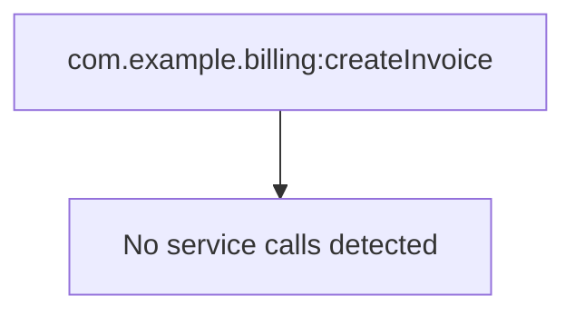

# com.example.billing:createInvoice

| Field | Value |
| --- | --- |
| Package | `SampleOrder` |
| Namespace | `com.example.billing` |
| Service | `createInvoice` |
| Type | `java_service` |
| Node type | `unknown` |
| Node subtype | `default` |
| Structure | real package path |

## Node Comment

Example Java service; implementation source is intentionally absent.

## Inference Notes

- Java implementation source could not be uniquely resolved.

## Source Files

- node: `/media/kamil/2ndDisk/prv/work/docGen/examples/sample-packages/SampleOrder/ns/com/example/billing/createInvoice/node.ndf`

## Warnings

- `JAVA_SOURCE_NOT_FOUND`: Java service implementation source could not be found by service name. (/media/kamil/2ndDisk/prv/work/docGen/examples/sample-packages/SampleOrder)

## Inputs

- `order` (recref) -> `com.example.docs:Order`

## Outputs

- `invoiceId` (string)

## Invoked Services

_No service calls detected._

## Document References

- `com.example.docs:Order` from node.sig_in `order`

## Dynamic Invocation Risks

_No dynamic invocation patterns detected._

## Dependency Diagram

## Steps

_No flow steps parsed for this service._
