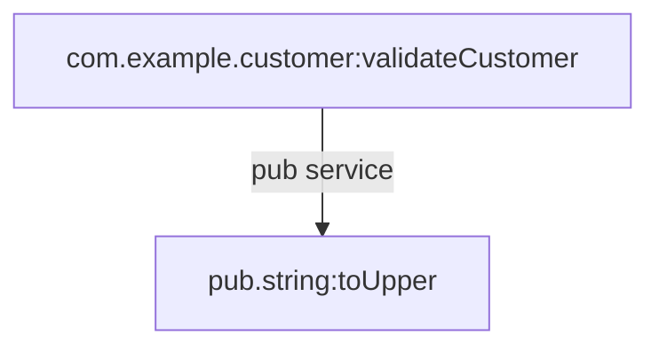

# com.example.customer:validateCustomer

| Field | Value |
| --- | --- |
| Package | `SampleOrder` |
| Namespace | `com.example.customer` |
| Service | `validateCustomer` |
| Type | `flow_service` |
| Node type | `unknown` |
| Node subtype | `default` |
| Structure | real package path |

## Source Files

- flow: `/media/kamil/2ndDisk/prv/work/docGen/examples/sample-packages/SampleOrder/ns/com/example/customer/validateCustomer/flow.xml`
- node: `/media/kamil/2ndDisk/prv/work/docGen/examples/sample-packages/SampleOrder/ns/com/example/customer/validateCustomer/node.ndf`

## Inputs

- `customerId` (string)

## Outputs

- `valid` (string)

## Invoked Services

| Target | Kind | Step |
| --- | --- | --- |
| `pub.string:toUpper` | `pub_service` | `0.0.0.0` |

## Document References

_No document references detected._

## Dynamic Invocation Risks

_No dynamic invocation patterns detected._

## Dependency Diagram

## Steps

- `FLOW` comment='Validate customer'
  - `SEQUENCE`
    - `MAP` comment='Normalize customer id'
      - `MAPINVOKE` service=`pub.string:toUpper`
