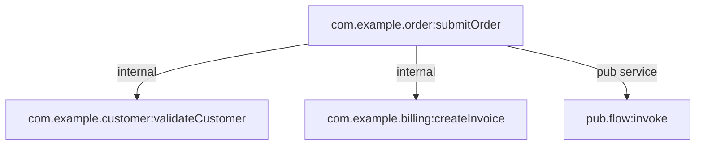

# com.example.order:submitOrder

| Field | Value |
| --- | --- |
| Package | `SampleOrder` |
| Namespace | `com.example.order` |
| Service | `submitOrder` |
| Type | `flow_service` |
| Node type | `unknown` |
| Node subtype | `default` |
| Structure | real package path |

## Node Comment

Example order submission flow service.

## Source Files

- flow: `/media/kamil/2ndDisk/prv/work/docGen/examples/sample-packages/SampleOrder/ns/com/example/order/submitOrder/flow.xml`
- node: `/media/kamil/2ndDisk/prv/work/docGen/examples/sample-packages/SampleOrder/ns/com/example/order/submitOrder/node.ndf`

## Warnings

- `DYNAMIC_INVOKE_TARGET_UNKNOWN`: Dynamic invocation via 'pub.flow:invoke' at step 0.0.2; target cannot be resolved statically. (/media/kamil/2ndDisk/prv/work/docGen/examples/sample-packages/SampleOrder/ns/com/example/order/submitOrder/flow.xml)

## Inputs

- `order` (recref) -> `com.example.docs:Order`

## Outputs

- `invoiceId` (string)

## Invoked Services

| Target | Kind | Step |
| --- | --- | --- |
| `com.example.customer:validateCustomer` | `internal` | `0.0.0` |
| `com.example.billing:createInvoice` | `internal` | `0.0.1` |
| `pub.flow:invoke` | `pub_service` | `0.0.2` |

## Document References

- `com.example.docs:Order` from node.sig_in `order`

## Dynamic Invocation Risks

- `pub.flow:invoke` at step `0.0.2`
  Candidate fields: `MAPSET@FIELD=/serviceName;1;0`
  Candidate values: `com.example.audit:publishOrderSubmitted`

## Dependency Diagram

## Steps

- `FLOW` comment='Submit order orchestration'
  - `SEQUENCE` comment='main'
    - `INVOKE` service=`com.example.customer:validateCustomer` comment='Validate customer'
    - `INVOKE` service=`com.example.billing:createInvoice` comment='Create invoice'
    - `INVOKE` service=`pub.flow:invoke` comment='Dynamic audit publication'
      - `MAP` maps=1
