# synthetic.current:flow_1

| Field | Value |
| --- | --- |
| Package | `synthetic.current` |
| Namespace | `synthetic.current` |
| Service | `flow_1` |
| Structure | inferred |

## Inference Notes

- No manifest.v3/ns package structure was found for this flow file.
- Package, namespace, and service name are inferred.

## Source Files

- flow: `/media/kamil/2ndDisk/prv/work/docGen/flow(1).xml`
- node: `/media/kamil/2ndDisk/prv/work/docGen/node.ndf`

## Warnings

- `INFERRED_STRUCTURE`: Service structure is inferred because the artifacts are not inside a package ns tree. (/media/kamil/2ndDisk/prv/work/docGen/flow(1).xml)

## Inputs

- `input` (recref) -> `oa.adapter.doc.geographicAddressManagement.geographicAddressValidation:docCreateGeographicAddressValidationInput`

## Outputs

- `output` (recref) -> `oa.adapter.doc.geographicAddressManagement.geographicAddressValidation:docCreateGeographicAddressValidationOutput`

## Invoked Services

| Target | Kind | Step |
| --- | --- | --- |
| `pub.list:sizeOfList` | `pub_service` | `0.0.2.0` |
| `oa.adapter.services.common:getProviderConnection` | `external_service` | `0.1.0.0.0` |
| `pub.list:sizeOfList` | `pub_service` | `0.1.0.1.0.0.0.0.0` |
| `pub.string:toUpper` | `pub_service` | `0.1.0.1.0.0.0.1.0.0.0` |
| `oa.adapter.services.geographicAddressManagement.geographicAddress:findGeographicAddressesForValidations` | `external_service` | `0.1.0.1.0.0.0.2.0.0` |
| `oa.adapter.services.geographicAddressManagement.geographicAddress:findGeographicAddressesForValidations` | `external_service` | `0.1.0.1.0.0.0.2.1.0.0` |
| `oa.adapter.services.geographicAddressManagement.geographicAddress:findGeographicAddressesForValidations` | `external_service` | `0.1.0.1.0.0.0.2.2.0` |
| `pub.list:sizeOfList` | `pub_service` | `0.1.0.1.0.0.0.3.0` |
| `oa.adapter.services.geographicAddressManagement.geographicAddressValidation:getGeographicAddressValidation` | `external_service` | `0.1.0.1.0.0.1.0.0` |
| `oa.adapter.services.common:isPatchAllowed` | `external_service` | `0.1.0.1.0.0.1.1.0` |
| `di.utils.bool:strBoolToNumber` | `external_service` | `0.1.0.1.0.1.0.0.0` |
| `inea.utils:stringToDate` | `external_service` | `0.1.0.1.0.2.0.0.0` |
| `oa.adapter.services.geographicAddressManagement.geographicAddress:createGeographicAddress` | `external_service` | `0.1.0.1.0.2.1.1.0.0.0` |
| `oa.adapter.services.geographicAddressManagement.geographicAddress:createGeographicAddress` | `external_service` | `0.1.0.1.0.2.1.2.0.0.0` |
| `di.utils.bool:strBoolToNumber` | `external_service` | `0.1.0.1.0.2.2.0` |
| `di.utils:generateTransactionName` | `external_service` | `0.1.0.1.0.2.3.0` |
| `pub.art.transaction:startTransaction` | `pub_service` | `0.1.0.1.0.2.4.0.0` |
| `oa.adapter.db_flow._create:createGeographicAddresssValidation` | `external_service` | `0.1.0.1.0.2.4.0.1.0` |
| `oa.adapter.db_flow._create:createGAVFailReason` | `external_service` | `0.1.0.1.0.2.4.0.3.1.0.0` |
| `pub.art.transaction:commitTransaction` | `pub_service` | `0.1.0.1.0.2.4.1.0` |
| `pub.art.transaction:rollbackTransaction` | `pub_service` | `0.1.0.1.0.2.4.1.1.0` |
| `pub.flow:getLastError` | `pub_service` | `0.1.0.1.0.2.5.0` |
| `pub.art.transaction:rollbackTransaction` | `pub_service` | `0.1.0.1.0.2.5.1` |
| `oa.adapter.services.common:checkErrorResult` | `external_service` | `0.1.0.1.0.2.5.2.0` |
| `oa.adapter.services.geographicAddressManagement.geographicAddressValidation:getGeographicAddressValidation` | `external_service` | `0.1.0.1.0.2.6.0.0` |
| `oa.adapter.services.geographicAddressManagement.geographicAddressValidation:getGeographicAddressValidation` | `external_service` | `0.1.0.1.0.2.6.1.0` |
| `oa.adapter.services.geographicAddressManagement.geographicAddress:getGeographicAddress` | `external_service` | `0.1.0.1.0.2.7.0` |
| `di.utils:nullToUnspecified` | `external_service` | `0.1.0.1.0.3.0.0` |
| `pub.date:formatDate` | `pub_service` | `0.1.0.1.0.3.1.0.0.0.0` |
| `oa.adapter.db_flow._get:getNewEventId` | `external_service` | `0.1.0.1.0.3.3.0` |
| `pub.date:getCurrentDateString` | `pub_service` | `0.1.0.1.0.3.5.0` |
| `di.utils:generateTransactionName` | `external_service` | `0.1.0.1.0.3.6.0` |
| `pub.art.transaction:startTransaction` | `pub_service` | `0.1.0.1.0.3.7.0` |
| `oa.adapter.services.common:saveEvent` | `external_service` | `0.1.0.1.0.3.7.1.0` |
| `pub.art.transaction:commitTransaction` | `pub_service` | `0.1.0.1.0.3.7.2.0.0` |
| `pub.publish:publish` | `pub_service` | `0.1.0.1.0.3.7.2.0.1` |
| `pub.art.transaction:rollbackTransaction` | `pub_service` | `0.1.0.1.0.3.7.2.1.0` |
| `pub.flow:getLastError` | `pub_service` | `0.1.0.1.0.3.8.0` |
| `pub.art.transaction:rollbackTransaction` | `pub_service` | `0.1.0.1.0.3.8.1` |
| `oa.adapter.services.common:checkErrorResult` | `external_service` | `0.1.0.1.0.3.8.2.0` |
| `pub.flow:getLastError` | `pub_service` | `0.1.1.0` |
| `oa.adapter.services.common:checkErrorResult` | `external_service` | `0.1.1.1.0` |
| `pub.flow:clearPipeline` | `pub_service` | `0.2.0` |

## Document References

- `oa.adapter.doc.geographicAddressManagement.geographicAddressValidation:docCreateGeographicAddressValidationInput` from flow
- `oa.adapter.doc.geographicAddressManagement.geographicAddressValidation:docCreateGeographicAddressValidationOutput` from flow
- `oa.model.geographicAddressManagement:docGeographicSubAddress` from flow
- `oa.model.geographicAddressManagement:docGeographicAddress` from flow
- `oa.model.geographicAddressManagement:docGeographicAddressValidation` from flow
- `cdm.common.baseType:docErrorResult` from flow
- `pub.event:exceptionInfo` from flow
- `oa.hub.geographicAddressValidationManagement:docGeographicAddressValidationHub` from flow
- `oa.model.SIDCommon.common.baseTypes:docErrorResult` from flow
- `oa.adapter.doc.geographicAddressManagement.geographicAddressValidation:docCreateGeographicAddressValidationInput` from node.sig_in `input`
- `oa.adapter.doc.geographicAddressManagement.geographicAddressValidation:docCreateGeographicAddressValidationOutput` from node.sig_out `output`

## Dependency Diagram

```mermaid
graph TD
  n_synthetic_current_flow_1["synthetic.current:flow_1"]
  n_synthetic_current_flow_1 -->|pub service| n_pub_list_sizeOfList["pub.list:sizeOfList"]
  n_synthetic_current_flow_1 -->|external service| n_oa_adapter_services_common_getProviderConnection["oa.adapter.services.common:getProviderConnection"]
  n_synthetic_current_flow_1 -->|pub service| n_pub_list_sizeOfList["pub.list:sizeOfList"]
  n_synthetic_current_flow_1 -->|pub service| n_pub_string_toUpper["pub.string:toUpper"]
  n_synthetic_current_flow_1 -->|external service| n_oa_adapter_services_geographicAddressManagement_geographicAddress_findGeographicAddressesForValidations["oa.adapter.services.geographicAddressManagement.geographicAddress:findGeographicAddressesForValidations"]
  n_synthetic_current_flow_1 -->|external service| n_oa_adapter_services_geographicAddressManagement_geographicAddress_findGeographicAddressesForValidations["oa.adapter.services.geographicAddressManagement.geographicAddress:findGeographicAddressesForValidations"]
  n_synthetic_current_flow_1 -->|external service| n_oa_adapter_services_geographicAddressManagement_geographicAddress_findGeographicAddressesForValidations["oa.adapter.services.geographicAddressManagement.geographicAddress:findGeographicAddressesForValidations"]
  n_synthetic_current_flow_1 -->|pub service| n_pub_list_sizeOfList["pub.list:sizeOfList"]
  n_synthetic_current_flow_1 -->|external service| n_oa_adapter_services_geographicAddressManagement_geographicAddressValidation_getGeographicAddressValidation["oa.adapter.services.geographicAddressManagement.geographicAddressValidation:getGeographicAddressValidation"]
  n_synthetic_current_flow_1 -->|external service| n_oa_adapter_services_common_isPatchAllowed["oa.adapter.services.common:isPatchAllowed"]
  n_synthetic_current_flow_1 -->|external service| n_di_utils_bool_strBoolToNumber["di.utils.bool:strBoolToNumber"]
  n_synthetic_current_flow_1 -->|external service| n_inea_utils_stringToDate["inea.utils:stringToDate"]
  n_synthetic_current_flow_1 -->|external service| n_oa_adapter_services_geographicAddressManagement_geographicAddress_createGeographicAddress["oa.adapter.services.geographicAddressManagement.geographicAddress:createGeographicAddress"]
  n_synthetic_current_flow_1 -->|external service| n_oa_adapter_services_geographicAddressManagement_geographicAddress_createGeographicAddress["oa.adapter.services.geographicAddressManagement.geographicAddress:createGeographicAddress"]
  n_synthetic_current_flow_1 -->|external service| n_di_utils_bool_strBoolToNumber["di.utils.bool:strBoolToNumber"]
  n_synthetic_current_flow_1 -->|external service| n_di_utils_generateTransactionName["di.utils:generateTransactionName"]
  n_synthetic_current_flow_1 -->|pub service| n_pub_art_transaction_startTransaction["pub.art.transaction:startTransaction"]
  n_synthetic_current_flow_1 -->|external service| n_oa_adapter_db_flow__create_createGeographicAddresssValidation["oa.adapter.db_flow._create:createGeographicAddresssValidation"]
  n_synthetic_current_flow_1 -->|external service| n_oa_adapter_db_flow__create_createGAVFailReason["oa.adapter.db_flow._create:createGAVFailReason"]
  n_synthetic_current_flow_1 -->|pub service| n_pub_art_transaction_commitTransaction["pub.art.transaction:commitTransaction"]
  n_synthetic_current_flow_1 -->|pub service| n_pub_art_transaction_rollbackTransaction["pub.art.transaction:rollbackTransaction"]
  n_synthetic_current_flow_1 -->|pub service| n_pub_flow_getLastError["pub.flow:getLastError"]
  n_synthetic_current_flow_1 -->|pub service| n_pub_art_transaction_rollbackTransaction["pub.art.transaction:rollbackTransaction"]
  n_synthetic_current_flow_1 -->|external service| n_oa_adapter_services_common_checkErrorResult["oa.adapter.services.common:checkErrorResult"]
  n_synthetic_current_flow_1 -->|external service| n_oa_adapter_services_geographicAddressManagement_geographicAddressValidation_getGeographicAddressValidation["oa.adapter.services.geographicAddressManagement.geographicAddressValidation:getGeographicAddressValidation"]
  n_synthetic_current_flow_1 -->|external service| n_oa_adapter_services_geographicAddressManagement_geographicAddressValidation_getGeographicAddressValidation["oa.adapter.services.geographicAddressManagement.geographicAddressValidation:getGeographicAddressValidation"]
  n_synthetic_current_flow_1 -->|external service| n_oa_adapter_services_geographicAddressManagement_geographicAddress_getGeographicAddress["oa.adapter.services.geographicAddressManagement.geographicAddress:getGeographicAddress"]
  n_synthetic_current_flow_1 -->|external service| n_di_utils_nullToUnspecified["di.utils:nullToUnspecified"]
  n_synthetic_current_flow_1 -->|pub service| n_pub_date_formatDate["pub.date:formatDate"]
  n_synthetic_current_flow_1 -->|external service| n_oa_adapter_db_flow__get_getNewEventId["oa.adapter.db_flow._get:getNewEventId"]
  n_synthetic_current_flow_1 -->|pub service| n_pub_date_getCurrentDateString["pub.date:getCurrentDateString"]
  n_synthetic_current_flow_1 -->|external service| n_di_utils_generateTransactionName["di.utils:generateTransactionName"]
  n_synthetic_current_flow_1 -->|pub service| n_pub_art_transaction_startTransaction["pub.art.transaction:startTransaction"]
  n_synthetic_current_flow_1 -->|external service| n_oa_adapter_services_common_saveEvent["oa.adapter.services.common:saveEvent"]
  n_synthetic_current_flow_1 -->|pub service| n_pub_art_transaction_commitTransaction["pub.art.transaction:commitTransaction"]
  n_synthetic_current_flow_1 -->|pub service| n_pub_publish_publish["pub.publish:publish"]
  n_synthetic_current_flow_1 -->|pub service| n_pub_art_transaction_rollbackTransaction["pub.art.transaction:rollbackTransaction"]
  n_synthetic_current_flow_1 -->|pub service| n_pub_flow_getLastError["pub.flow:getLastError"]
  n_synthetic_current_flow_1 -->|pub service| n_pub_art_transaction_rollbackTransaction["pub.art.transaction:rollbackTransaction"]
  n_synthetic_current_flow_1 -->|external service| n_oa_adapter_services_common_checkErrorResult["oa.adapter.services.common:checkErrorResult"]
  n_synthetic_current_flow_1 -->|pub service| n_pub_flow_getLastError["pub.flow:getLastError"]
  n_synthetic_current_flow_1 -->|external service| n_oa_adapter_services_common_checkErrorResult["oa.adapter.services.common:checkErrorResult"]
  n_synthetic_current_flow_1 -->|pub service| n_pub_flow_clearPipeline["pub.flow:clearPipeline"]
```

## Steps

- `FLOW` comment='init'
  - `SEQUENCE` comment='init'
    - `MAP` comment='init' maps=3
    - `BRANCH`
      - `MAP` name=`%input/geographicAddressValidation/status% == $null ` comment='Set Statu' maps=1
    - `MAP` comment='Check alternateAddressListSize'
      - `MAPINVOKE` service=`pub.list:sizeOfList`
        - `MAP` maps=1
        - `MAP` maps=1
  - `SEQUENCE` comment='try - catch'
    - `SEQUENCE` name=`try1` comment='try'
      - `MAP` comment='call oa.adapter.services.common:getProviderConnection'
        - `MAPINVOKE` service=`oa.adapter.services.common:getProviderConnection`
          - `MAP` maps=1
          - `MAP` maps=2
      - `BRANCH` comment='Check connection name'
        - `SEQUENCE` name=`%connectionName% != $null`
          - `BRANCH` comment='GAV has id'
            - `SEQUENCE` name=`%input/geographicAddressValidation/id% == $null`
              - `MAP` comment='Check subAddressListSize'
                - `MAPINVOKE` service=`pub.list:sizeOfList`
                  - `MAP` maps=1
                  - `MAP` maps=1
              - `BRANCH` comment='find first flat subAddress'
                - `LOOP` name=`%subAddressListSize% != 0`
                  - `MAP` comment='call pub.string:toUpper'
                    - `MAPINVOKE` service=`pub.string:toUpper`
                      - `MAP` maps=1
                      - `MAP` maps=1
                  - `BRANCH` comment='Check if flat'
                    - `SEQUENCE` name=`%subUnitType% == 'FLAT'`
                      - `MAP` maps=1
                      - `EXIT`
              - `BRANCH` comment='Check search criteria'
                - `MAP` name=`%input/geographicAddressValidation/validAddress/ulic% == $null && %input/geographicAddressValidation/validAddress/terc% == $null && %input/geographicAddressValidation/validAddress/simc% == $null`
                  - `MAPINVOKE` service=`oa.adapter.services.geographicAddressManagement.geographicAddress:findGeographicAddressesForValidations`
                    - `MAP` maps=5
                    - `MAP` maps=2
                - `SEQUENCE` name=`%input/geographicAddressValidation/validAddress/ulic% == $null`
                  - `MAP` comment='call oa.adapter.services.geographicAddressManagement.geographicAddress:findGeographicAddressesForValidations'
                    - `MAPINVOKE` service=`oa.adapter.services.geographicAddressManagement.geographicAddress:findGeographicAddressesForValidations`
                      - `MAP` maps=6
                      - `MAP` maps=2
                  - `BRANCH`
                    - `SEQUENCE` name=`$null` comment='skip adresses with streetName described if streetName and ulic is null'
                      - `LOOP`
                        - `BRANCH`
                          - `SEQUENCE` name=`(%geographicAddresses/streetName%==$null || %geographicAddresses/streetName%=='') && (%geographicAddresses/ulic%==$null || %geographicAddresses/ulic%=='99999')`
                            - `MAP` maps=1
                            - `EXIT`
                          - `MAP` name=`$default` comment='NOOP'
                      - `BRANCH`
                        - `MAP` name=`$null` maps=2
                        - `MAP` name=`$default` maps=2
                    - `MAP` name=`$default` comment='NOOP'
                - `MAP` name=`$default` comment='call oa.adapter.services.geographicAddressManagement.geographicAddress:findGeographicAddressesForValidations'
                  - `MAPINVOKE` service=`oa.adapter.services.geographicAddressManagement.geographicAddress:findGeographicAddressesForValidations`
                    - `MAP` maps=6
                    - `MAP` maps=2
              - `MAP` comment='Check geographicAddressListSize'
                - `MAPINVOKE` service=`pub.list:sizeOfList`
                  - `MAP` maps=1
                  - `MAP` maps=1
              - `BRANCH` comment='Check findResults'
                - `MAP` name=`%geographicAddressListSize% >= 1` maps=1
                - `MAP` name=`$default`
            - `SEQUENCE` name=`%input/geographicAddressValidation/id% != $null`
              - `MAP` comment='call oa.adapter.services.geographicAddressManagement.geographicAddressValidation:getGeographicAddressValidation' maps=1
                - `MAPINVOKE` service=`oa.adapter.services.geographicAddressManagement.geographicAddressValidation:getGeographicAddressValidation`
                  - `MAP` maps=2
                  - `MAP` maps=4
              - `MAP` comment='call oa.adapter.services.common:isPatchAllowed'
                - `MAPINVOKE` service=`oa.adapter.services.common:isPatchAllowed`
                  - `MAP` maps=3
                  - `MAP` maps=2
              - `BRANCH`
                - `SEQUENCE` name=`%isPatchAllowed% == 'false'`
                  - `MAP` comment='Map error' maps=3
                  - `EXIT`
          - `BRANCH` comment='Old GAV exists'
            - `SEQUENCE` name=`%oldGeographicAddressValidation% != $null`
              - `MAP` comment='Set GAV props' maps=2
                - `MAPINVOKE` service=`di.utils.bool:strBoolToNumber`
                  - `MAP` maps=1
                  - `MAP` maps=1
          - `SEQUENCE` comment='Save GA & GAV'
            - `BRANCH` comment='Check validationDate'
              - `MAP` name=`%input/geographicAddressValidation/validationDate% != $null`
                - `MAPINVOKE` service=`inea.utils:stringToDate`
                  - `MAP` maps=2
                  - `MAP` maps=1
            - `BRANCH` comment='Check if validationExists'
              - `MAP` name=`%oldGeographicAddress/id% != $null` maps=1
              - `SEQUENCE` name=`%oldGeographicAddressValidation/id% != $null`
                - `BRANCH` comment='Check validationResult'
                  - `MAP` name=`%input/geographicAddressValidation/validationResult% == 'success'`
                    - `MAPINVOKE` service=`oa.adapter.services.geographicAddressManagement.geographicAddress:createGeographicAddress`
                      - `MAP` maps=21
                      - `MAP` maps=4
                  - `MAP` name=`$default` maps=1
              - `SEQUENCE` name=`$default`
                - `BRANCH` comment='Add validAddress'
                  - `MAP` name=`%input/geographicAddressValidation/validAddress% != $null`
                    - `MAPINVOKE` service=`oa.adapter.services.geographicAddressManagement.geographicAddress:createGeographicAddress`
                      - `MAP` maps=21
                      - `MAP` maps=2
                - `BRANCH`
                  - `MAP` name=`0` comment='NOP'
                  - `SEQUENCE` name=`$default`
                    - `EXIT`
            - `MAP` comment='call di.utils.bool:strBoolToNumber'
              - `MAPINVOKE` service=`di.utils.bool:strBoolToNumber`
                - `MAP` maps=1
                - `MAP` maps=1
            - `MAP` comment='call di.utils:generateTransactionName'
              - `MAPINVOKE` service=`di.utils:generateTransactionName`
                - `MAP`
                - `MAP` maps=1
            - `SEQUENCE`
              - `SEQUENCE` name=`main` comment='main logic'
                - `INVOKE` service=`pub.art.transaction:startTransaction`
                  - `MAP` maps=1
                  - `MAP` maps=1
                - `MAP` comment='call oa.adapter.db_flow._create:createGeographicAddresssValidation'
                  - `MAPINVOKE` service=`oa.adapter.db_flow._create:createGeographicAddresssValidation`
                    - `MAP` maps=11
                    - `MAP` maps=2
                - `BRANCH`
                  - `MAP` name=`$null` comment='NOOP'
                  - `SEQUENCE` name=`$default`
                    - `MAP` comment='map adapterErrorResult to output/errorResult' maps=2
                    - `EXIT`
                - `BRANCH`
                  - `MAP` name=`$null` comment='NOP'
                  - `SEQUENCE` name=`$default` comment='createGAVFailReason'
                    - `MAP` comment='call oa.adapter.db_flow._create:createGAVFailReason'
                      - `MAPINVOKE` service=`oa.adapter.db_flow._create:createGAVFailReason`
                        - `MAP` maps=5
                        - `MAP` maps=2
                    - `BRANCH`
                      - `MAP` name=`$null` comment='NOP'
                      - `SEQUENCE` name=`$default`
                        - `MAP` comment='map adapterErrorResult to output/errorResult' maps=2
                        - `EXIT`
              - `BRANCH`
                - `INVOKE` name=`0` service=`pub.art.transaction:commitTransaction`
                  - `MAP` maps=1
                  - `MAP`
                - `SEQUENCE` name=`$default`
                  - `INVOKE` service=`pub.art.transaction:rollbackTransaction` comment='rollback transaction'
                    - `MAP` maps=1
                    - `MAP` maps=1
                  - `EXIT`
            - `SEQUENCE`
              - `INVOKE` service=`pub.flow:getLastError`
                - `MAP`
                - `MAP` maps=1
              - `INVOKE` service=`pub.art.transaction:rollbackTransaction`
                - `MAP` maps=1
                - `MAP`
              - `MAP` comment='call oa.adapter.services.common:checkErrorResult'
                - `MAPINVOKE` service=`oa.adapter.services.common:checkErrorResult`
                  - `MAP` maps=1
                  - `MAP` maps=1
              - `EXIT`
            - `BRANCH` comment='Pobranie wartości statusu przed aktualizacją'
              - `MAP` name=`$null` comment='call oa.adapter.services.geographicAddressManagement.geographicAddressValidation:getGeographicAddressValidation'
                - `MAPINVOKE` service=`oa.adapter.services.geographicAddressManagement.geographicAddressValidation:getGeographicAddressValidation`
                  - `MAP` maps=2
                  - `MAP` maps=4
              - `MAP` name=`$default` comment='call oa.adapter.services.geographicAddressManagement.geographicAddressValidation:getGeographicAddressValidation'
                - `MAPINVOKE` service=`oa.adapter.services.geographicAddressManagement.geographicAddressValidation:getGeographicAddressValidation`
                  - `MAP` maps=2
                  - `MAP` maps=4
            - `MAP` comment='call oa.adapter.services.geographicAddressManagement.geographicAddress:getGeographicAddress'
              - `MAPINVOKE` service=`oa.adapter.services.geographicAddressManagement.geographicAddress:getGeographicAddress`
                - `MAP` maps=2
                - `MAP` maps=4
            - `MAP` comment='map geographicAddressValidationId' maps=5
          - `SEQUENCE` comment='Notyfikacja'
            - `MAP` comment='Init notification' maps=3
              - `MAPINVOKE` service=`di.utils:nullToUnspecified`
                - `MAP` maps=1
                - `MAP` maps=1
            - `BRANCH` comment='ROZWIĄZANIE TYMCZASOWE !!!'
              - `SEQUENCE` name=`TMOBILE`
                - `BRANCH`
                  - `MAP` name=`%input/geographicAddressValidation/validationDate% != $null` comment='Set TMOBILE accepted format date'
                    - `MAPINVOKE` service=`pub.date:formatDate`
                      - `MAP` maps=2
                      - `MAP` maps=1
            - `BRANCH` comment='Ustalenie typu notyfikacji'
              - `MAP` name=`%/geographicAddressValidationIdOld% != $null` comment='statusChange' maps=1
            - `MAP` comment='call oa.adapter.db_flow._get:getNewEventId'
              - `MAPINVOKE` service=`oa.adapter.db_flow._get:getNewEventId`
                - `MAP` maps=1
                - `MAP` maps=2
            - `BRANCH`
              - `MAP` name=`$null` comment='NOOP'
              - `SEQUENCE` name=`$default`
                - `MAP` comment='map adapterErrorResult to output/errorResult' maps=2
                - `EXIT`
            - `MAP` comment='get eventTime'
              - `MAPINVOKE` service=`pub.date:getCurrentDateString`
                - `MAP` maps=2
                - `MAP` maps=1
            - `MAP` comment='call di.utils:generateTransactionName'
              - `MAPINVOKE` service=`di.utils:generateTransactionName`
                - `MAP`
                - `MAP` maps=1
            - `SEQUENCE`
              - `INVOKE` service=`pub.art.transaction:startTransaction`
                - `MAP` maps=1
              - `MAP` comment='call oa.adapter.services.common:saveEvent'
                - `MAPINVOKE` service=`oa.adapter.services.common:saveEvent`
                  - `MAP` maps=8
                  - `MAP` maps=3
              - `BRANCH`
                - `SEQUENCE` name=`0`
                  - `INVOKE` service=`pub.art.transaction:commitTransaction`
                    - `MAP` maps=1
                  - `INVOKE` service=`pub.publish:publish` comment='pushing'
                    - `MAP` maps=3
                - `SEQUENCE` name=`$default`
                  - `INVOKE` service=`pub.art.transaction:rollbackTransaction`
                    - `MAP` maps=1
                    - `MAP`
            - `SEQUENCE`
              - `INVOKE` service=`pub.flow:getLastError`
                - `MAP`
                - `MAP` maps=1
              - `INVOKE` service=`pub.art.transaction:rollbackTransaction`
                - `MAP` maps=1
                - `MAP`
              - `MAP` comment='call oa.adapter.services.common:checkErrorResult'
                - `MAPINVOKE` service=`oa.adapter.services.common:checkErrorResult`
                  - `MAP` maps=1
                  - `MAP` maps=1
    - `SEQUENCE` comment='catch'
      - `INVOKE` service=`pub.flow:getLastError`
        - `MAP`
        - `MAP` maps=1
      - `MAP` comment='call oa.adapter.services.common:checkErrorResult'
        - `MAPINVOKE` service=`oa.adapter.services.common:checkErrorResult`
          - `MAP` maps=1
          - `MAP` maps=1
  - `SEQUENCE` comment='finally'
    - `INVOKE` service=`pub.flow:clearPipeline`
      - `MAP` maps=1
